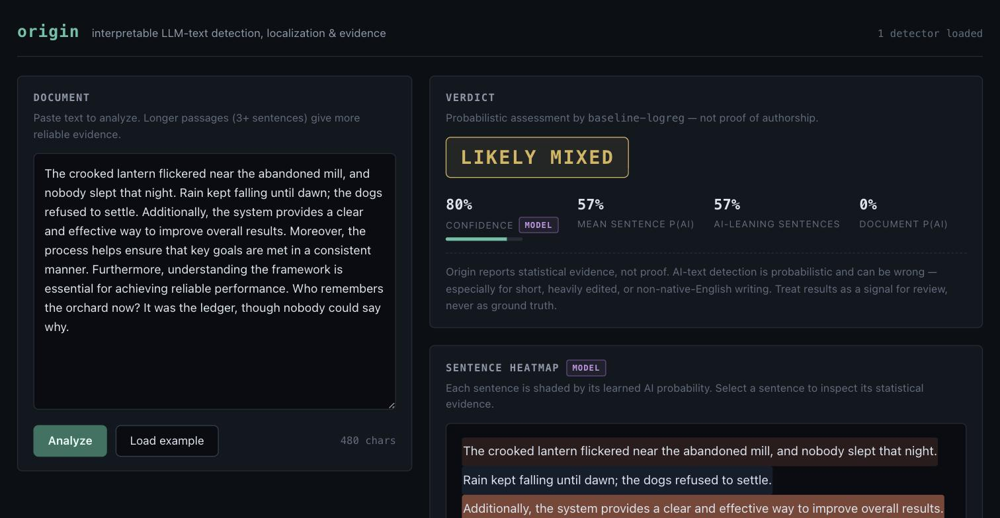

# Origin

**Interpretable detection, localization, and explanation of LLM-generated text.**

Origin is a research platform and production-quality application to explore a concept I was interested on how to detect whether a text is generated by AI, written by a human, or a mixture of both (taken from inspiration of how accurate GPTZero is). 

Instead of emitting a single opaque score, Origin classifies documents as
**Human / AI / Mixed**, localizes the verdict to individual sentences, and shows the
statistical evidence such as perplexity, surprisal, burstiness, lexical and stylistic
features.



## What's inside

- **Statistical feature engine** — token log probabilities, surprisal, document and
  sentence perplexity, perplexity variance/burstiness, sentence-length statistics,
  lexical diversity (TTR/MATTR/hapax), repetition (distinct-n), and
  vocabulary-band/style features, behind a typed, composable `FeaturePipeline`.
- **Classical detector** — calibrated logistic regression (Platt scaling on
  out-of-fold scores) trained at both document and sentence granularity, exported
  as self-contained, pickle-free JSON artifacts with feature importances and
  per-class training distributions embedded for explainability.
- **Neural detector** — a Hugging Face transformer sentence classifier (any
  checkpoint) with a documented Human/AI/Mixed aggregation rule, a seeded training
  loop, and checkpoint save/load. CPU always works; CUDA/MPS used when available.
- **Mixed-text localization** — sentence segmentation with exact character offsets
  that round-trip against the original document; per-sentence AI probabilities from
  either detector family.
- **Research evaluation** — accuracy/precision/recall/F1/AUROC/Brier/calibration,
  sentence-level localization metrics, seen vs unseen-model-family and
  paraphrase-robustness slices, a five-way ablation framework, machine-readable
  results, and publication-quality figures.
- **FastAPI backend + React frontend + CLI** — the same analysis engine behind an
  OpenAPI-documented HTTP API, a research-tool web UI, and a full command line.

## Research questions

1. **RQ1** Is a document human-written, AI-generated, or mixed?
2. **RQ2** Which sentences are most likely AI-generated?
3. **RQ3** What statistical signals support the prediction?
4. **RQ4** How well does detection generalize to unseen model families?
5. **RQ5** How robust is detection to paraphrasing, temperature, and mixing?
6. **RQ6** Do neural detectors learn signals similar to classical
   perplexity/surprisal features?

The experiment protocol, metric definitions, and ablation matrix live in
[`RESEARCH.md`](RESEARCH.md).

## How detection works

**Perplexity & surprisal.** A causal language model assigns each token a probability
given its left context. *Surprisal* (`-log2 P`, in bits) measures how unexpected a
token is; *perplexity* (`exp(-mean log P)`) summarizes a passage. Text sampled from
an LLM tends to be unusually predictable under an LLM (low perplexity, few high-surprisal tokens) because the generator picked likely tokens in the first
place.

**Burstiness.** Human writing varies: long winding sentences next to two-word
fragments, predictable stretches next to surprising ones. Origin measures the
Goh–Barabási burstiness index and coefficient of variation over sentence
perplexities and sentence lengths; sampled text is typically more uniform.

**Statistical vs neural detection.** The classical path is a calibrated logistic
regression over ~40 interpretable features. Every coefficient can be inspected
(`origin train baseline` prints the top ones). The neural path fine-tunes a
transformer to classify sentences directly. The ablation framework quantifies what
each signal family contributes, and RQ6 correlation analysis measures how much the
two agree.

**Heuristic vs model evidence.** Everything Origin shows is tagged: feature values,
surprisal series, and distribution comparisons are `heuristic` (direct
measurements); sentence probabilities and verdicts are `model` (learned classifier
outputs). The UI, API, and CLI preserve this distinction end to end.

## Limitations — read this

AI-text detection is **statistical inference, never proof**:

- Short texts carry little signal
- Human editing, paraphrasing tools, and unusual sampling settings shift text across
  the decision boundary in both directions.
- Possibility of false positives
- Detectors generalize imperfectly to model families absent from training

Every Origin result carries an explicit disclaimer. Treat outputs as a signal for
review, never as ground truth about authorship.

## Getting started

Prerequisites: [uv](https://docs.astral.sh/uv/) (manages Python 3.12 automatically)
and Node.js ≥ 20.

```bash
git clone <this-repo> origin && cd origin
uv sync                        # Python env from the committed lockfile
cd apps/web && npm ci && cd ../..   # frontend deps from the committed lockfile
```

### Run the app

```bash
# Terminal 1 — API (demo detectors train at startup on the bundled corpus, ~5 s)
uv run uvicorn origin_api.main:app --port 8000

# Terminal 2 — web UI (proxies /api to :8000)
cd apps/web && npm run dev     # → http://localhost:5173
```

Interactive API docs: <http://localhost:8000/docs>. Configuration (artifact
directories, HF scorers, a neural checkpoint) is via environment variables — see
[`.env.example`](.env.example).

### Command line

```bash
uv run origin analyze --text "Your document here..."      # verdict + heatmap + evidence
uv run origin analyze essay.txt --json                    # full evidence bundle as JSON
uv run origin features essay.txt                          # raw feature vector
```

## Training & evaluation

```bash
# Train classical document + sentence baselines → JSON artifacts
uv run origin train baseline --dataset data/sample/documents.jsonl --out artifacts/baseline

# Analyze / serve with those artifacts
uv run origin analyze --text "..." --artifacts artifacts/baseline
ORIGIN_ARTIFACT_DIR=artifacts/baseline uv run uvicorn origin_api.main:app --port 8000

# Evaluate on the held-out split (documents + sentence localization + mixed docs)
uv run origin evaluate --artifacts artifacts/baseline --dataset data/sample/documents.jsonl --out metrics.json

# Fine-tune the neural sentence classifier from any HF checkpoint
uv run origin train neural --checkpoint distilbert-base-uncased --out artifacts/neural

# Full research experiment: 5 ablations × all slices → results.json + figures
uv run origin experiment experiments/sample.json          # outputs in runs/sample-full/
```

All of the above run offline on the bundled sample corpus with the deterministic
stub scorer. For real perplexity signals, pass `--scorer hf:distilgpt2` (or any
causal checkpoint) — the first use downloads the model.

### Real corpora & robustness to newer models

Two importers build real training corpora (not committed; regenerated locally):

```bash
uv run python scripts/import_hc3.py               # HC3: human vs ChatGPT answers
uv run python scripts/import_mage.py              # MAGE: 7 model families × 10 domains,
                                                  # + GPT-4 out-of-distribution testbeds
uv run origin train baseline --scorer hf:distilgpt2 \
    --dataset data/combined/documents.jsonl --out artifacts/robust
uv run python scripts/eval_robust.py --artifacts artifacts/robust \
    --dataset data/combined/documents.jsonl \
    --ood data/mage/ood_gpt4.jsonl --ood-para data/mage/ood_gpt4_para.jsonl
```

Measured on this protocol (interpretable logistic regression, distilgpt2 scorer):

| Evaluation | AUROC |
|---|---|
| Held-out test, 8 seen families | 0.90 |
| **GPT-4 — family AND domain never seen in training** | **0.81** |
| GPT-4 + paraphrase attack | 0.48 (chance) |

Two findings worth internalizing: detection transfers meaningfully to an unseen
newer model because it rests on an ensemble of distributional signals rather
than raw perplexity alone (a pilot showed perplexity by itself only reaches
AUROC ≈ 0.61 on GPT-4 text); and a determined paraphrase attack still defeats
the detector entirely — an honest ceiling that mirrors the published
literature, not a bug in this implementation.

### Sample data

`data/sample/documents.jsonl` is a **synthetic fixture corpus** (102 documents:
human / AI across three fictional model families / paraphrases / span-labelled
mixed documents) generated deterministically by `scripts/build_sample_data.py`.
It exists so the entire pipeline runs end to end offline; scores on it validate
the machinery, not real-world detection ability (see `data/sample/README.md`).

## Adding datasets and models

- **Datasets** — implement or reuse an adapter in `origin_ml/datasets/adapters.py`:
  `PlainTextFolderAdapter` for directories of `.txt` files,
  `JsonlFieldMapAdapter` for arbitrary JSONL corpora (declarative field mapping).
  Records validate against the typed `DocumentRecord` schema (labels, span labels
  for mixed text, model family/name/provider, temperature, prompt metadata,
  transform lineage). Leakage-safe splitting is automatic: records sharing a
  `group_id` (e.g. a document and its paraphrase) never straddle splits, and
  `family_holdout_split` supports unseen-family evaluation.
- **Scorers** — anything implementing the `Scorer` protocol; `HFCausalScorer`
  wraps any causal LM checkpoint.
- **Neural detectors** — any HF sequence-classification checkpoint via
  `NeuralDetector.from_checkpoint`; `origin train neural` fine-tunes it on the
  sentence examples derived from your corpus.

## Reproducibility

- Pinned environments: `uv.lock`, `package-lock.json`, `.python-version`.
- Every stochastic step is seeded (splits are pure functions of
  `(seed, group_id)`; training seeds Python/NumPy/Torch).
- Experiment outputs embed their config, seed, and git commit.
- The unit test suite is fully offline and deterministic: heavyweight models are
  replaced by committed ~200 KiB HF fixtures (`scripts/build_test_fixtures.py`);
  real-checkpoint tests are opt-in (`pytest -m integration`).

## Development

```bash
bash scripts/verify.sh    # canonical gate: lint, types, tests, smoke, frontend build
uv run pytest             # Python tests (offline)
uv run ruff check . && uv run ruff format --check . && uv run mypy .
cd apps/web && npm run lint && npm run test && npm run build
```

## Repository layout

```text
origin/
├── apps/
│   ├── api/origin_api/   # FastAPI backend (registry-isolated model loading)
│   └── web/              # React + TypeScript research UI (Vite)
├── origin_ml/
│   ├── text/             # sentence segmentation & tokenization (exact offsets)
│   ├── scoring/          # Scorer protocol, HF causal scorer, deterministic stubs
│   ├── features/         # interpretable feature engine + pipeline
│   ├── detectors/        # classical & neural detectors, aggregation rule
│   ├── training/         # classical + neural training entry points
│   ├── evaluation/       # metrics, slices, ablations, experiment runner, plots
│   ├── datasets/         # schema, JSONL I/O, leakage-safe splits, adapters
│   ├── explainability/   # evidence bundles, end-to-end analyze_document
│   └── cli.py            # `origin` command line
├── data/sample/          # committed synthetic fixture corpus
├── experiments/          # experiment configs
├── scripts/              # verify.sh, smoke test, data/fixture generators
└── tests/                # offline deterministic test suite + tiny HF fixtures
```
